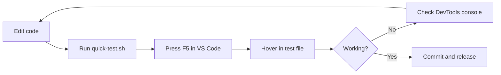

# VS Code Extension Quick Test Guide

## Fast Feedback Loop

Instead of publishing and installing the extension every time, use this quick test workflow:

### 1. Quick Manual Test

```bash
# From the packages/vscode directory
./scripts/quick-test.sh
```

This will:

1. Build the extension if not already built
2. Open VS Code with the **extension workspace** (`packages/vscode`)
3. Print the list of shared manual fixtures

**Then in VS Code:**

1. Press **F5** to launch "Extension Development Host"
2. The shared fixtures from `test-data/manual/` open as tabs, and the fixture folder opens in the Explorer
3. Hover over any number, variable, or annotated expression; each line's trailing comment states the expected result

### 2. Test Fixtures

Manual fixtures are shared by the VS Code and Neovim workflows and live in [`test-data/manual/`](../../test-data/manual):

| File | Language |
| ------ | ---------- |
| `durations.py` | Python |
| `durations.ts` | TypeScript |
| `durations.js` | JavaScript |
| `durations.go` | Go |
| `durations.rs` | Rust |
| `durations.java` | Java |
| `durations.cs` | C# |
| `durations.yaml` | YAML |
| `durations.json` | JSON |
| `durations.toml` | TOML |
| `durations.lua` | Lua |

Each file exercises unit suffixes, context keywords, expressions, keyword
arguments, `timedelta` calls, variable-in-variable resolution, and ignored
values. Expected hover output is in each line's trailing comment; see
[`test-data/manual/README.md`](../../test-data/manual/README.md) for details,
including the comment-free JSON fixture.

### 3. Debug Commands

While testing in the Extension Development Host:

| Command | Purpose |
| --------- | --------- |
| `Timescope: Dump Settings` | Show current configuration |
| `Timescope: Log Hover Target` | Log hover target info for debugging |
| `Timescope: Toggle` | Enable/disable extension |
| `Developer: Toggle Developer Tools` | Open DevTools console |

### 4. Automated Tests

Run the complete automated suite from the repository root:

```bash
pnpm test
```

Run the full editor E2E suite:

```bash
pnpm test:e2e
```

For interactive manual testing, use the VS Code helper from the repository root:

```bash
pnpm test:manual:vscode
```

For the equivalent Neovim workflow:

```bash
pnpm test:manual:nvim
```

### 5. Build and Package

```bash
# Build all packages
pnpm -r run build

# Package VSIX
cd packages/vscode
npm run package
```

## Workflow Summary



## Tips

1. **Use the Extension Development Host** - This loads your local code, not the published extension
2. **Check the TimeScope output channel** - View → Output → Select "TimeScope" from dropdown
3. **Use DevTools** - Help → Toggle Developer Tools to see console logs
4. **Reload window** - Ctrl+Shift+P → "Developer: Reload Window" to reload extension after changes

## Common Issues

| Issue | Solution |
| ------- | ---------- |
| No hover appears | Check TimeScope output channel for errors |
| Wrong unit detected | Use context clues (variable names with units) |
| Extension not loading | Check that `npm run compile` succeeded |
| Settings not updating | Reload window or restart Extension Development Host |
