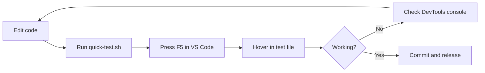

# VS Code Extension Quick Test Guide

## Fast Feedback Loop

Instead of publishing and installing the extension every time, use this quick test workflow:

### 1. Quick Manual Test

```bash
# From the packages/vscode directory
./scripts/quick-test.sh
```

This will:

1. Build the extension if not already built
2. Open VS Code with the **extension workspace** (`packages/vscode`) and test file (`test-data/sample.ts`)
3. Print instructions for testing

**Then in VS Code:**

1. Press **F5** to launch "Extension Development Host"
2. The test file opens automatically in the new window
3. Hover over any number to see TimeScope in action

### 2. Test File Overview

The `test-data/sample.ts` file contains:

| Case | Example | Expected Result |
| ------ | --------- | ---------------- |
| Basic seconds | `HELLO = 120` | `2m` |
| Context: timeout | `TIMEOUT = 300` | `5m` |
| Context: delay | `DELAY = 5000` | `5s` |
| Context: retry | `RETRY_INTERVAL = 30000` | `30s` |
| Context: cache | `CACHE_TTL = 3600` | `1h` |
| Context: age | `MAX_AGE = 86400` | `1d` |
| With ms suffix | `retryDelayMs = 5000` | `5s` |
| With seconds suffix | `timeoutSeconds = 120` | `2m` |
| With hours suffix | `cacheDurationHours = 48` | `2d` |
| Expressions | `ONE_HOUR_SECONDS = 60 * 60` | `1h` |
| New: hours | `VALUE_HOURS = 24` | `1d` |
| New: days | `VALUE_DAYS = 7` | `1w` |
| New: weeks | `VALUE_WEEKS = 2` | `2w` |
| New: months | `VALUE_MONTHS = 3` | `3mo` |
| New: years | `VALUE_YEARS = 1` | `12mo 5d` |
| Edge: zero | `ZERO = 0` | No hover (minValue = 1) |
| Edge: large | `VERY_LARGE = 9999999999999` | No hover (maxValue) |
| Edge: hex | `HEX = 0xFF` | No hover (ignore pattern) |
| Edge: IP | `IP = 1921681` | No hover (ignore pattern) |

### 3. Debug Commands

While testing in the Extension Development Host:

| Command | Purpose |
| --------- | --------- |
| `Timescope: Dump Settings` | Show current configuration |
| `Timescope: Log Hover Target` | Log hover target info for debugging |
| `Timescope: Toggle` | Enable/disable extension |
| `Developer: Toggle Developer Tools` | Open DevTools console |

### 4. Automated Tests

Run the core test suite:

```bash
cd /home/rifen/proj/timescope
pnpm --filter @rifen/timescope-core test
```

Run VS Code extension tests:

```bash
cd packages/vscode
npm test
```

### 5. Build and Package

```bash
# Build all packages
pnpm -r run build

# Package VSIX
cd packages/vscode
npm run package
```

## Workflow Summary



## Tips

1. **Use the Extension Development Host** - This loads your local code, not the published extension
2. **Check the TimeScope output channel** - View → Output → Select "TimeScope" from dropdown
3. **Use DevTools** - Help → Toggle Developer Tools to see console logs
4. **Reload window** - Ctrl+Shift+P → "Developer: Reload Window" to reload extension after changes

## Common Issues

| Issue | Solution |
| ------- | ---------- |
| No hover appears | Check TimeScope output channel for errors |
| Wrong unit detected | Use context clues (variable names with units) |
| Extension not loading | Check that `npm run compile` succeeded |
| Settings not updating | Reload window or restart Extension Development Host |
