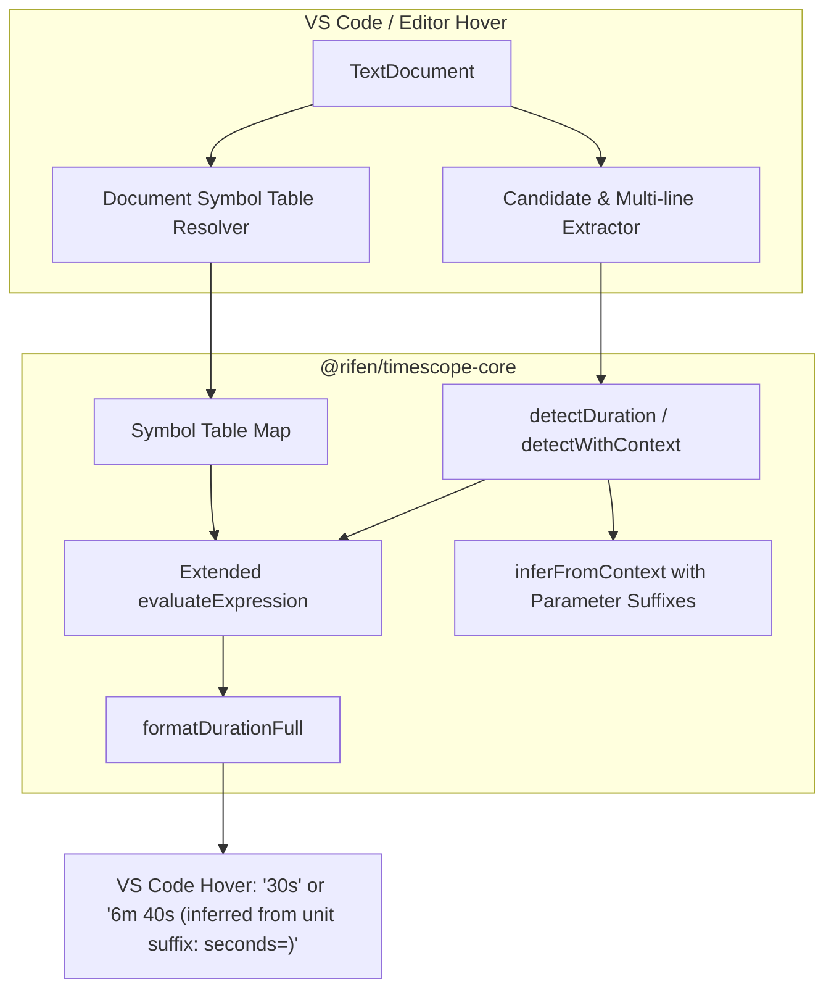
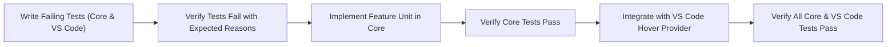

# Specification: Variable-in-Variable Resolution (#26) & Parameter Duration Detection (#28)

**Status:** Implemented — verified locally and in CI suites  
**Target Packages:** [`@rifen/timescope-core`](file:///home/rifen/proj/timescope/packages/core) & [`rifen-timescope` (VS Code extension)](file:///home/rifen/proj/timescope/packages/vscode)  
**Related Issues:** [Issue #26: Support for use of variables inside variables](https://github.com/rifen/timescope/issues/26) | [Issue #28: Support Parameters](https://github.com/rifen/timescope/issues/28)

---

## 1. Executive Summary & Objectives

TimeScope currently detects raw numeric literals and basic arithmetic expressions (e.g. `60 * 60 * 24`) located on a single line. However, modern production codebases frequently define duration constants using:
1. **Named parameters / keyword arguments** with unit clues (e.g. `start_to_close_timeout=timedelta(seconds=400)` or `execute(timeout_seconds=30)`).
2. **Standard duration constructors**, notably Python's `timedelta(...)` (and `datetime.timedelta(...)`).
3. **Derived variables and expressions referencing prior variables** (e.g. `COMMIT_TIMER_ARM_ACTIVITY_SECONDS = int(COMMIT_TIMER_ARM_TIMEOUT_SECONDS) + 15`).
4. **Multi-line parenthesized expressions** common in Python and TypeScript (e.g. `MIN_COMMIT_TIMER_SECONDS = (\n COMMIT_TIMER_SETTLE_SECONDS + ...\n)`).
5. **Type casts / conversions** like `int(...)` and `float(...)` wrapping variable references or expressions.

This specification establishes the architecture, test plan (with failing tests written first), and dependency-ordered tasks to deliver full support for Issues #26 and #28 without breaking any invariants (such as zero runtime dependencies and strict ReDoS protection).

---

## 2. Issue Analysis & Requirements

### 2.1 Issue #28: Support Parameters & `timedelta`

#### Problem
In Python or configurations like:
```python
start_to_close_timeout=timedelta(seconds=400)
```
- Current behavior: Tokenization splits on `=` discarding the parameter name, and candidate extraction captures `timedelta(seconds=400)`, which `evaluateExpression` rejects because it only permits `[\d+\-*/().]`. No hover is displayed, or hovering on `400` lacks the `seconds=` parameter context hint.
- Expected behavior:
  - Hovering on `400` or `seconds=400`: detects `400 seconds` -> `6m 40s`, with context hint `unit suffix: "seconds="`.
  - Hovering on `timedelta(seconds=400)` or `start_to_close_timeout`: evaluates `timedelta(seconds=400)` -> `400s` -> `6m 40s`.

#### Scope of Parameter Support
- **Keyword arguments**: `name=value` or `name = value` (e.g. `seconds=400`, `timeout_seconds=30`, `retry_delay_ms=250`).
- **Object key/value**: `name: value` (e.g. `seconds: 400`, `timeout_seconds: 30`).
- **Unit matching on parameter names**:
  - `seconds=`, `second=`, `sec=`, `secs=`, `s=` -> `seconds`
  - `milliseconds=`, `millisecond=`, `millis=`, `ms=` -> `milliseconds`
  - `microseconds=`, `microsecond=`, `micros=`, `us=` -> `microseconds`
  - `nanoseconds=`, `nanosecond=`, `nanos=`, `ns=` -> `nanoseconds`
  - `minutes=`, `minute=`, `min=`, `mins=`, `m=` -> `minutes`
  - `hours=`, `hour=`, `hr=`, `hrs=`, `h=` -> `hours`
  - `days=`, `day=`, `d=` -> `days`
  - `weeks=`, `week=`, `w=` -> `weeks`
- **Constructor evaluation for `timedelta`**:
  - Arguments supported: `days`, `seconds`, `microseconds`, `milliseconds`, `minutes`, `hours`, `weeks`.
  - Positional argument order matching Python stdlib: `(days=0, seconds=0, microseconds=0, milliseconds=0, minutes=0, hours=0, weeks=0)`.
  - Composite sums: `timedelta(hours=1, minutes=30)` -> `90 minutes` -> `1h 30m`.

---

### 2.2 Issue #26: Support for Variables Inside Variables

#### Problem
In Python/TypeScript/etc. code:
```python
COMMIT_TIMER_CONFIRM_TIMEOUT_SECONDS = 15.0
COMMIT_TIMER_SETTLE_SECONDS = 5
COMMIT_TIMER_CONFIRM_MARGIN_SECONDS = 10

COMMIT_TIMER_ARM_ACTIVITY_SECONDS = int(COMMIT_TIMER_ARM_TIMEOUT_SECONDS) + 15

MIN_COMMIT_TIMER_SECONDS = (
    COMMIT_TIMER_SETTLE_SECONDS
    + int(COMMIT_TIMER_CONFIRM_TIMEOUT_SECONDS)
    + COMMIT_TIMER_CONFIRM_MARGIN_SECONDS
)
```
- Current behavior:
  - `evaluateExpression` rejects any token with variable names like `COMMIT_TIMER_SETTLE_SECONDS` or functions like `int(...)`.
  - Single-line candidate extraction fails on multi-line statements like `MIN_COMMIT_TIMER_SECONDS = (\n...`.
  - Timescope has no concept of a symbol table to resolve identifier values from earlier in the document.
- Expected behavior:
  - Hovering on `COMMIT_TIMER_ARM_ACTIVITY_SECONDS` evaluates `15 + 15 = 30s`.
  - Hovering on `MIN_COMMIT_TIMER_SECONDS` evaluates `5 + 15 + 10 = 30s`.
  - Hovering over usage of these variables later in code also displays `30s`.

#### Scope of Variable Resolution
- **Symbol Table Construction**:
  - Scan the document/file to find constant and variable assignments:
    - Standard assignments: `NAME = EXPR`
    - Typed assignments: `NAME: TYPE = EXPR`
    - JS/TS declarations: `const/let/var NAME = EXPR`
  - Maintain a bounded symbol table map `Map<string, { value: number, unit?: DetectedDuration["unit"] }>`.
- **Topological / Forward Evaluation**:
  - When variable `B` references variable `A`, resolve `A` first.
  - Cycle detection and maximum evaluation depth (10 levels) to prevent infinite loops.
- **Type Casts & Built-in Numeric Functions**:
  - `int(x)` / `Math.trunc(x)`: truncates/rounds towards zero.
  - `float(x)` / `Number(x)`: converts to numeric float.
  - `round(x)` / `Math.round(x)`: rounds to nearest integer.
- **Multi-Line Statement Candidate Extraction**:
  - When an assignment starts with `(` or ends with an unclosed operator (`+`, `-`, `*`, `/`), scan forward to the balancing `)` or line end.

---

## 3. Architecture & Data Flow



### 3.1 Security & Invariants
1. **Zero Runtime Dependencies**: All parsing is hand-crafted recursive descent; no external math or AST libraries.
2. **ReDoS Safety**: No `RegExp` constructed dynamically from code content or parameter names. Bounded regexes or string slicing only.
3. **No `eval()` or `Function()`**: Pure arithmetic and expression parsing.
4. **Bounds & Caps**:
   - Maximum expression length: 500 characters.
   - Maximum symbol table size per file: 1,000 entries.
   - Maximum recursion / resolution depth: 10.

---

## 4. Test-Driven Strategy (Failing Tests First)

Before writing production logic, tests must be added to verify failure against current implementation and guide implementation:



1. **Parameter & Unit Suffix Tests** (`packages/core/src/__tests__/detectDuration.test.ts`):
   - `detectDuration("400", "start_to_close_timeout=timedelta(seconds=400)")` -> unit `seconds`, contextHint `unit suffix: "seconds="`.
   - `detectDuration("50", "retry_interval(ms=50)")` -> unit `milliseconds`, contextHint `unit suffix: "ms="`.
   - `detectDuration("10", "poll(minutes=10)")` -> unit `minutes`, contextHint `unit suffix: "minutes="`.
2. **`timedelta` Expression Tests** (`packages/core/src/__tests__/formatting.test.ts`):
   - `evaluateExpression("timedelta(seconds=400)")` -> 400.
   - `evaluateExpression("timedelta(minutes=5, seconds=30)")` -> 330.
   - `evaluateExpression("datetime.timedelta(hours=2)")` -> 7200.
3. **Type-Casting & Variable Evaluation Tests** (`packages/core/src/__tests__/formatting.test.ts`):
   - `evaluateExpression("int(15.0) + 15")` -> 30.
   - `evaluateExpression("float(5.5) * 2")` -> 11.
   - `evaluateExpression("A + B", { A: 10, B: 20 })` -> 30.
   - `evaluateExpression("int(A) + 15", { A: 15.0 })` -> 30.
4. **Automated Hover Tests for Issues #26 & #28** (`packages/core/src/__tests__/hoverAutomation.test.ts` and `packages/vscode/test/hoverAutomation.test.ts`):
   - Hover on `COMMIT_TIMER_ARM_ACTIVITY_SECONDS` -> `30s`.
   - Hover on multi-line `MIN_COMMIT_TIMER_SECONDS = (\n...)` -> `30s`.
   - Hover on `start_to_close_timeout=timedelta(seconds=400)` -> `6m 40s`.

---

## 5. Dependency-Ordered Implementation Tasks

Each task is scoped to <= 5 files and verified with specific commands.

### Phase 1: Parameter & Unit Suffix Detection (#28)

- [x] Task 1: Add failing tests for parameter unit suffixes (Issue #28)
  - Acceptance: Tests fail asserting `unit suffix: "seconds="` and related parameter keyword suffixes (`ms=`, `minutes=`, `hours=`, etc.) in `detectDuration.test.ts`.
  - Verify: `pnpm --filter @rifen/timescope-core test` fails specifically on the new assertions.
  - Files:
    - [`packages/core/src/__tests__/detectDuration.test.ts`](file:///home/rifen/proj/timescope/packages/core/src/__tests__/detectDuration.test.ts)

- [x] Task 2: Implement parameter unit suffix detection in `inferFromContext` (Issue #28)
  - Acceptance: Parameter syntax (`param=value`, `param = value`, `param: value`) preserves the `=` or `:` suffix in context clue matching and produces `contextHint: 'unit suffix: "seconds="'`.
  - Verify: `pnpm --filter @rifen/timescope-core test` passes Task 1 tests.
  - Files:
    - [`packages/core/src/detection/index.ts`](file:///home/rifen/proj/timescope/packages/core/src/detection/index.ts)

---

### Phase 2: Expression Evaluation for `timedelta`, Functions & Variables (#26 & #28)

- [x] Task 3: Add failing tests for `timedelta`, `int()`, `float()`, and variable evaluation
  - Acceptance: Tests in `formatting.test.ts` fail on `timedelta(seconds=400)`, `timedelta(minutes=5, seconds=30)`, `int(15.0) + 15`, and symbol lookup `A + B`.
  - Verify: `pnpm --filter @rifen/timescope-core test` fails specifically on the new expression tests.
  - Files:
    - [`packages/core/src/__tests__/formatting.test.ts`](file:///home/rifen/proj/timescope/packages/core/src/__tests__/formatting.test.ts)

- [x] Task 4: Extend `evaluateExpression` to support functions (`int`, `float`, `round`, `timedelta`) and variable contexts
  - Acceptance: `evaluateExpression(expr, variables)` safely evaluates arithmetic expressions with `int()`, `float()`, `round()`, `timedelta(...)`, and variable identifiers from a dictionary.
  - Verify: `pnpm --filter @rifen/timescope-core test` passes all formatting and evaluation tests.
  - Files:
    - [`packages/core/src/formatting/index.ts`](file:///home/rifen/proj/timescope/packages/core/src/formatting/index.ts)
    - [`packages/core/src/types/index.ts`](file:///home/rifen/proj/timescope/packages/core/src/types/index.ts)

---

### Phase 3: Document Symbol Table & Multi-Line Scanner (#26)

- [x] Task 5: Add failing tests for symbol table extraction and multi-line assignments
  - Acceptance: Tests in a new test suite or `scan.test.ts` fail to resolve multi-line statements and document-level symbol tables like the snippet in Issue #26.
  - Verify: `pnpm --filter @rifen/timescope-core test` fails specifically on the new symbol extraction tests.
  - Files:
    - [`packages/core/src/__tests__/scan.test.ts`](file:///home/rifen/proj/timescope/packages/core/src/__tests__/scan.test.ts)

- [x] Task 6: Implement document symbol table extractor and multi-line statement parser in Core
  - Acceptance: Core provides a utility (e.g. `buildSymbolTable(code)` or extended `scanCode`) that resolves variables defined earlier in a file, handles multi-line parenthesized assignments, and evaluates downstream variables.
  - Verify: `pnpm --filter @rifen/timescope-core test` passes all scan and symbol table tests.
  - Files:
    - [`packages/core/src/detection/index.ts`](file:///home/rifen/proj/timescope/packages/core/src/detection/index.ts)
    - [`packages/core/src/index.ts`](file:///home/rifen/proj/timescope/packages/core/src/index.ts)

---

### Phase 4: VS Code Extension Candidate Extraction & Hover Provider (#26 & #28)

- [x] Task 7: Add failing hover tests in VS Code test suite for Issues #26 & #28
  - Acceptance: `hoverAutomation.test.ts` in VS Code extension contains test cases for:
    1. `COMMIT_TIMER_ARM_ACTIVITY_SECONDS = int(COMMIT_TIMER_CONFIRM_TIMEOUT_SECONDS) + 15` -> `30s`
    2. Multi-line `MIN_COMMIT_TIMER_SECONDS = (\n ...)` -> `30s`
    3. `start_to_close_timeout=timedelta(seconds=400)` -> `6m 40s`
    And these tests fail before hover provider updates.
  - Verify: `pnpm --filter @rifen/timescope-core test` and `packages/vscode/test/hoverAutomation.test.ts` fail on these cases.
  - Files:
    - [`packages/core/src/__tests__/hoverAutomation.test.ts`](file:///home/rifen/proj/timescope/packages/core/src/__tests__/hoverAutomation.test.ts)
    - [`packages/vscode/test/hoverAutomation.test.ts`](file:///home/rifen/proj/timescope/packages/vscode/test/hoverAutomation.test.ts)

- [x] Task 8: Update VS Code `DurationHoverProvider` to handle multi-line candidates and document symbol resolution
  - Acceptance: `DurationHoverProvider` extracts multi-line parenthesized expressions, queries the document symbol table for variable values, and evaluates `timedelta(...)` constructs.
  - Verify: `npm --prefix packages/vscode run test` (or `node dist/test/hoverAutomation.test.js`) passes all test cases without warnings or errors.
  - Files:
    - [`packages/vscode/src/provider/durationHover.ts`](file:///home/rifen/proj/timescope/packages/vscode/src/provider/durationHover.ts)

---

### Phase 5: Build, Packaging & Static Analysis Verification

- [x] Task 9: Full monorepo build, packaging, and security check
  - Acceptance:
    - `pnpm -r run build` succeeds cleanly.
    - `pnpm security:opengrep` (or lint checks) report 0 security findings.
    - VS Code extension packaging succeeds with `--no-dependencies` and no runtime dependencies.
  - Verify:
    - `pnpm -r run build`
    - `pnpm --filter @rifen/timescope-core test`
    - `cd packages/vscode && npm run package`
  - Files:
    - No source files modified; verification of repo state.

---

## 6. Verification Criteria Matrix

| Feature | Input Sample | Expected Hover Display | Inferred Hint |
| :--- | :--- | :--- | :--- |
| **Parameter Unit Suffix (#28)** | `start_to_close_timeout=timedelta(seconds=400)` (hover on 400) | `6m 40s` | `*inferred from unit suffix: "seconds="*` |
| **Timedelta Call (#28)** | `start_to_close_timeout=timedelta(seconds=400)` (hover on variable or timedelta) | `6m 40s` | `timedelta(seconds=400)` |
| **Multi-arg Timedelta (#28)** | `delay = timedelta(minutes=5, seconds=30)` | `5m 30s` | `timedelta(minutes=5, seconds=30)` |
| **Variable Cast (#26)** | `COMMIT_TIMER_ARM_ACTIVITY_SECONDS = int(TIMEOUT) + 15` (TIMEOUT=15.0) | `30s` | Variable name `_SECONDS` suffix |
| **Multi-line Expression (#26)** | `MIN_COMMIT_TIMER_SECONDS = (\n SETTLE + ...\n)` | `30s` | Variable name `_SECONDS` suffix |

---

## 7. Implementation Notes

Deliberate simplifications made while implementing the tasks above:

- **No cycle detector / depth counter.** `buildSymbolTable` is a single forward pass over a
  `Map`; each expression only sees values resolved before it, so cycles and forward
  references simply fail to resolve. There is no recursion to bound, so the planned
  10-level depth cap was unnecessary.
- **Units are not stored in the symbol table.** Values are plain numbers; units are inferred
  from the variable or parameter name at detection time (`matchUnitSuffix`).
- **The hover provider does not join multi-line expressions itself.** When the hovered line
  only starts an assignment, `provideHover` falls back to looking up the variable name in
  `buildSymbolTable`, which already handles parenthesis-balanced joining.
- **VS Code hover tests live in `packages/vscode/test/suite/hoverAutomation.test.ts`.** They run
  in the extension host via `pnpm test:e2e`. The pre-existing standalone
  `packages/vscode/test/hoverAutomation.test.ts` requires `vscode` at runtime and is not
  wired into any CI job, so it was left untouched.
- **`scanCode` evaluates whole assignments before falling back to literal scanning.** This is
  what lets `MIN_COMMIT_TIMER_SECONDS = (...)` report one resolved item instead of its
  individual numeric literals.
